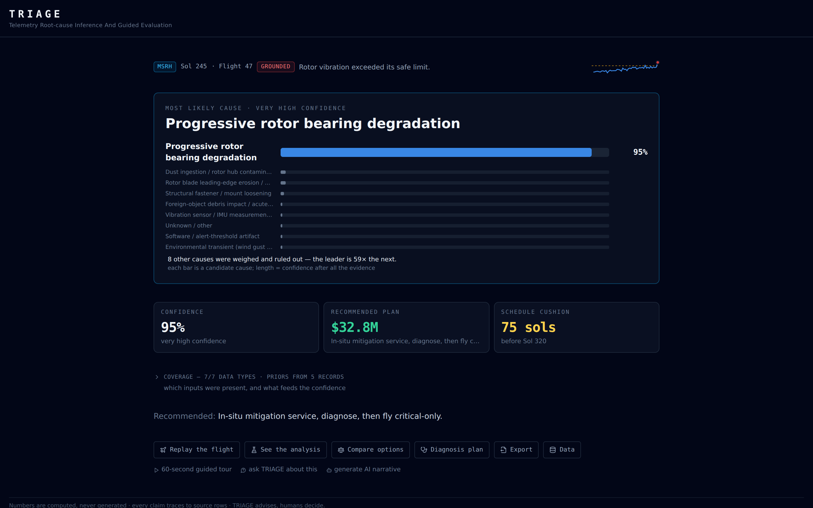
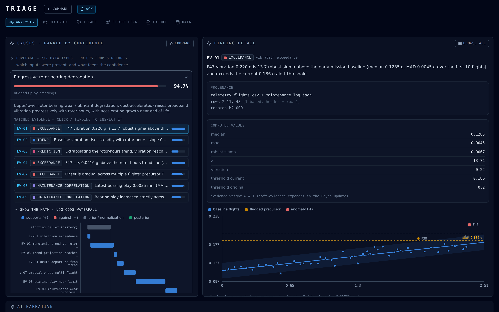
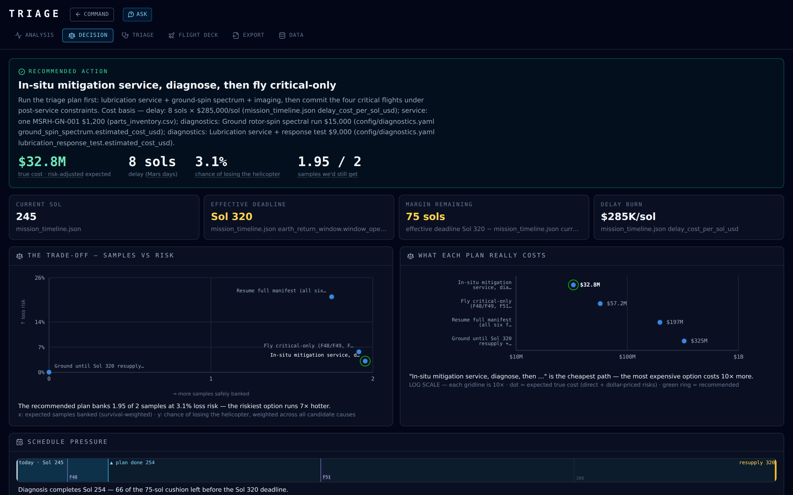
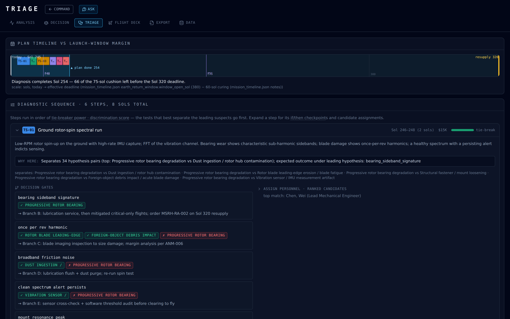
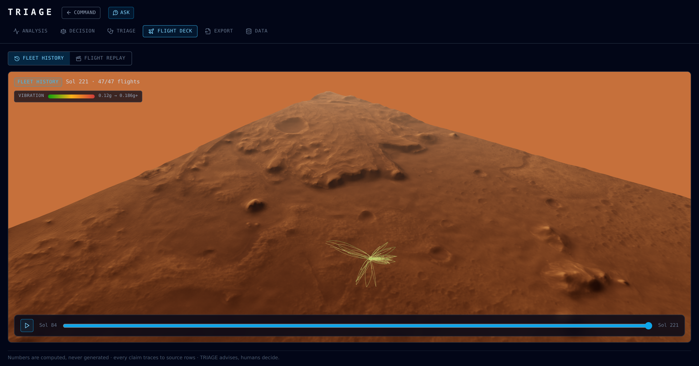
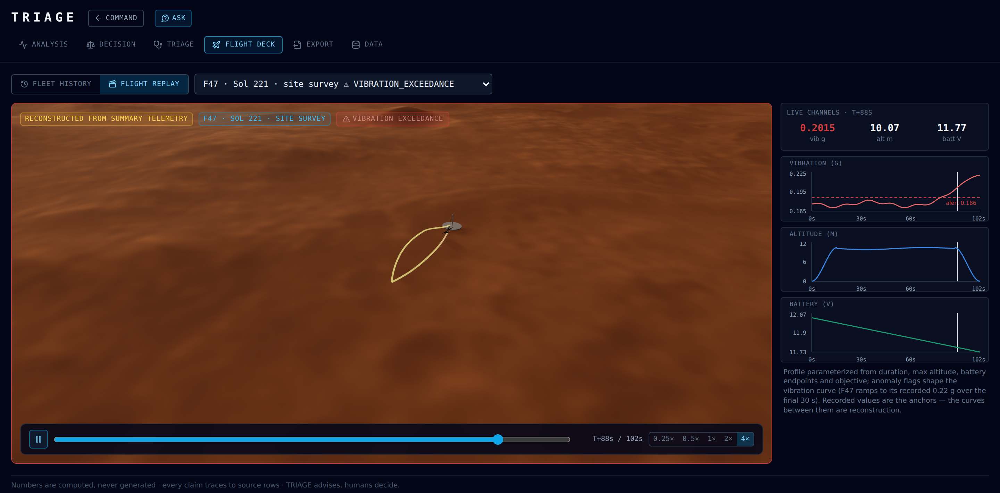
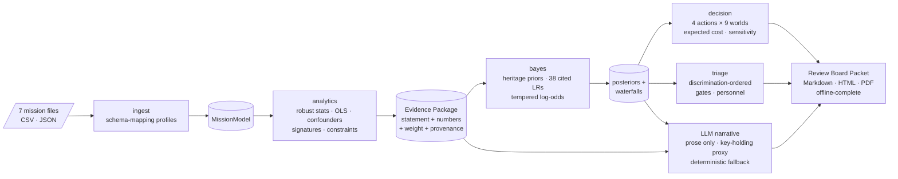
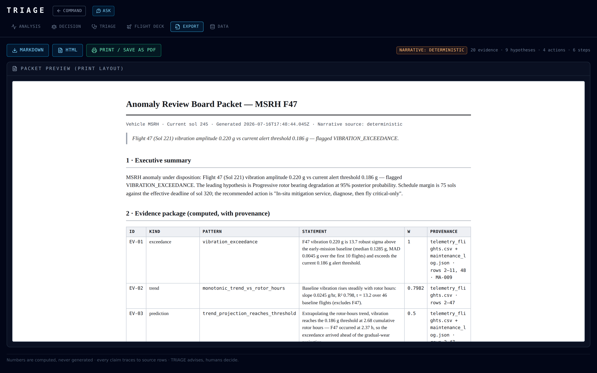

<div align="center">

# ✦ T R I A G E ✦

### **T**elemetry **R**oot-cause **I**nference **A**nd **G**uided **E**valuation

*An anomaly-disposition engine for planetary flight systems.*

**Numbers are computed, never generated · every claim traces to source rows · TRIAGE advises, humans decide.**


[The incident](#-the-incident) · [The verdict](#-sixty-seconds-later) · [The investigation](#-the-investigation) · [The decision](#-the-328m-question) · [Flight Deck](#-the-flight-deck) · [The AI, fenced](#-an-ai-on-a-very-short-leash) · [Proof](#-how-we-know-its-right) · [Quick start](#-quick-start)

</div>

---

## 🔴 The incident

> **JEZERO CRATER, MARS — Sol 245.**
>
> The alert comes up from the Mars Sample Return Helicopter: Flight 47, a routine 1.7-minute site survey, ended with rotor vibration ramping to **0.22 g** in its final 30 seconds — 18% over the 0.186 g alert threshold. Onboard fault protection grounded the aircraft automatically. Anomaly ANM-015 is logged: `CRITICAL`. Root cause: `UNDER INVESTIGATION`.
>
> Six flights are frozen at `HOLD_PENDING_ANOMALY_REVIEW` — and two of the six sample tubes needed for Earth return are still out on the crater floor. The flights that retrieve them, F48 and F51, sit on the frozen manifest's critical path. ST-19 is the last tube in the Delta region.
>
> The part that would fix it for good — the upper rotor bearing, MSRH-RA-002, $142,000, 52-week lead time — is not on Mars. The next resupply lands **Sol 320**. The Earth-return launch window opens Sol 380, but samples need 60 sols of curing first, so the *real* deadline is also **Sol 320**.
>
> **The one part you need arrives on the exact sol your schedule margin runs out.** Every sol of delay burns **$285,000**. The review board convenes. You have 75 sols.

TRIAGE is the tool on the review board's table. Feed it the mission's raw files and it computes — repeatably, auditably, offline if it must — **what broke, how sure we are, what it costs, and what to do next.**

<p align="center">
  
</p>

## ⚡ Sixty seconds later

Load the seven mission files (or click the bundled demo) and the Command View answers the four questions every review board asks, in one calm screen:

| Question | Answer | How it was produced |
|---|---|---|
| **What happened?** | Progressive rotor bearing degradation | Bayesian posterior over 9 candidate causes: **94.7%**, 59× the runner-up |
| **How sure are we?** | Very high confidence | Log-odds waterfall, auditable bar-by-bar down to CSV row numbers |
| **What should we do?** | Service in situ, diagnose, then fly critical-only | Cheapest of four costed plans: **$32.8M** expected vs $325M to ground |
| **How much time is left?** | 75 sols before Sol 320 | Derived from the timeline files — window open minus sample curing |

Everything on that screen is a drill-down. Every number traces to a file, a row, a record ID, or a cited engineering assertion. The AI wrote none of them.

## 🔬 The investigation

The evidence engine is pure, deterministic TypeScript — the statistics library is **144 lines of hand-rolled, dependency-free math** (median/MAD robust statistics, OLS with full inference stats, multivariate regression solved by Gaussian elimination on the normal equations). No ML framework. No black box. Every method chosen so a review board can re-derive it by hand:

- **How far outside normal?** Robust z-score against the first-10-flight baseline: F47 sits **13.7 robust sigma** above the early-mission norm (median/MAD deliberately, so no early outlier can inflate the baseline and understate the anomaly).
- **Is it wear?** Vibration vs. cumulative rotor-hours across the 46 *other* flights (F47 excluded, so the anomaly can't drag its own trend line): slope **0.0245 g/hr, R² 0.80, t = 13.2**. The pattern only fires at t ≥ 3 — significance-gated by config.
- **Is it worse than wear?** F47 is **~5 RMSE above its own trend** — a step change beyond steady degradation. This is the evidence that keeps the tool honest: it quietly supports the impact hypothesis, which is why foreign-object debris never drops to zero.
- **Was it just the wind?** The analytical centerpiece: a four-variable regression (wind, temperature, RPM, duration) shows environment explains only **14% of vibration variance**, and predicts 0.133 g for F47's conditions vs. the observed 0.220 g — a residual **4.8× the model's noise**. Then the clincher, found automatically: **Flight 23 flew the identical 11.9 m/s wind at 0.148 g.** Same wind, two-thirds the vibration. *The weather did not do this.*
- **Does the hardware history agree?** Regexes mine the free-text maintenance notes: bearing play grew **0.002 → 0.003 → 0.0035 mm** across three services — 87.5% of the 0.004 mm spec limit — and MA-010 had already written the warning, verbatim: *"Recommend bearing replacement before Flight 55 — NOTE: upper rotor bearing assembly not available at Mars depot."*
- **The engine argues against itself.** It flags that the alert threshold was lowered by a software patch just 13 sols before the anomaly (supporting "software artifact") — then counters its own objection: F47's 0.22 g exceeds even the *pre-patch* 0.20 g limit. The suspicion and the rebuttal both become evidence, both with provenance.

<p align="center">
  
</p>

<p align="center"><sub><b>The anti-black-box artifact.</b> Click any evidence chip and the right pane shows its provenance (<code>telemetry_flights.csv + maintenance_log.json · rows 2–11, 48 · records MA-009</code>), every computed intermediate, and the flight highlighted on the fleet trend. On the left: the log-odds waterfall — belief moving one piece of evidence at a time.</sub></p>

### From evidence to a number you can defend

The Bayesian layer is **230 lines of dependency-free TypeScript** — logs, sums, and a softmax — chosen over any learned model precisely because every step must be auditable:

- **Priors are learned from fleet history, not tuned.** Heritage anomaly records (Ingenuity's bearing failures among them) seed the priors by keyword match with Laplace smoothing: bearing degradation starts at 36.5% *before Flight 47's evidence is even considered*. The current anomaly is excluded from its own prior — no circular reasoning, by construction (a test asserts exactly which record was excluded).
- **38 likelihood ratios, 38 citations.** Every LR in the hypothesis config carries a human-readable justification declared beside it in `config/hypotheses.vibration.yaml` — and every waterfall bar clicks through to its underlying evidence and source rows. The config even argues against its own hypotheses — bearing wear declares LR 0.3 for sudden onset (*"wear rarely presents as a single-flight step change"*).
- **A humility knob.** Evidence items reading the same vibration channel aren't independent, so a global tempering factor **τ = 0.7** damps every update — a built-in brake on overconfidence. And **5% of the prior mass is reserved for "unknown/other"** — a catch-all that receives no evidence updates by construction, so its posterior can never reach zero: the model never claims it has enumerated every cause.
- **A machine-checked invariant.** For every hypothesis, the waterfall's final cumulative bar must equal ln(posterior) to within **1e-9** — enforced by tests on every scenario, including end-to-end.

Result: bearing degradation **36.5% → 94.7%**, and the "it was windy" hypothesis crushed from 7.3% → **0.1%**, almost entirely by the confounder regression — exactly as designed.

## 💰 The $32.8M question

Knowing the cause isn't the deliverable. The decision engine builds an explicit expected-cost tree — **4 candidate actions × 9 possible worlds = 36 dollarized outcomes**, posterior-weighted. Loss-of-vehicle survival math is exact closed form (no Monte Carlo): a survival walk over the sol-ordered manifest, verified against hand-derived formulas to 12 decimal places.

| Action | Expected cost | P(lose the helicopter) | Samples banked |
|---|---:|---:|---:|
| 🏆 **Service in situ, diagnose, fly critical-only** | **$32.8M** | 3.1% | **1.95 / 2** |
| Fly critical-only with mitigations | $57.2M | 5.7% | 1.91 / 2 |
| Resume full manifest | $197M | 21% | 1.75 / 2 |
| Ground until Sol 320 resupply | $325M | **0.05%** | **0 / 2** |

Read that last row again. **The safest option for the vehicle is the worst decision on the board** — grounding waits for a part that lands on the very sol the effective deadline expires (repair and verification finish ≈ Sol 330, past it), forfeits both irreplaceable samples, and burns 85 sols at $285K each. The whole table falls out of the mission files plus a config of *cited* engineering assertions — the 36-entry risk matrix cites heritage precedents like the ANM-010 bearing seizure, and the nominal per-flight baseline is anchored on Ingenuity's 72-flight no-loss record — kept strictly separate from computed values and labeled as assumptions everywhere they appear.

And the conclusion knows its own fragility — **sensitivity is computed, not asserted**: the engine re-scores the leading actions across bearing posteriors from 0.10 to 0.90 (the recommendation never flips) and solves for the vehicle-loss penalty at which grounding would win (~14× the asserted value).

<p align="center">
  
</p>

### Then: which test do you run *first*?

The triage planner orders diagnostics by **discrimination score** — the posterior-weighted count of hypothesis pairs each test separates, so a test that splits two *likely* suspects beats one that splits two long-shots. Winner: a $15,000 ground rotor-spin spectral run that separates **34 hypothesis pairs** — bearing sidebands vs. once-per-rev blade harmonics vs. broadband dust noise vs. mount resonance vs. a clean spectrum with a persisting alert, which indicts the sensor. Each step becomes an if/then decision gate with follow-on branches, staffed by ranked engineers — availability *multiplies* the score, because a perfectly qualified engineer who isn't available shouldn't top the list. Six steps, 8 sols, $46K, done by Sol 254 — consuming 9 of the 75-sol margin.

<p align="center">
  
</p>

## 🚁 The Flight Deck

The seven files contain no flight paths — telemetry is per-flight *summaries*. So TRIAGE renders the fleet's story over the **real floor of Jezero Crater** and is scrupulously honest about what's measured versus what's inferred.

<p align="center">
  
</p>

- **Real Mars terrain, no GIS stack.** A 10 km × 10 km window of the USGS **Mars 2020 CTX DEM** (20 m/px) and orthomosaic (6 m/px), centered on Octavia E. Butler Landing — Perseverance's landing site is the scene origin, and the crater floor sits 2.5 km below the Mars datum. A dependency-light Python baker (`scripts/bake_dem.py` — numpy + Pillow + tifffile, deliberately no GDAL) hand-rolls the Mars-2000 georeferencing from raw GeoTIFF tags and packs **16-bit elevations into the R and G channels of an ordinary PNG** — so the browser's stock image decoder becomes the DEM reader. No WASM, no server-side decoding, no GeoTIFF parsing in the browser.
- **NASA's own helicopter.** The replay flies NASA/JPL-Caltech's public-domain **Ingenuity glTF** (2.0 MB, Draco-compressed, decoder bundled locally). The GLB ships with no animation rig, so the code finds the two coaxial rotor assemblies by name and counter-rotates them — at a deliberately watchable 1.2 rad/s, because the true ~2,400 RPM strobes into a blur. If the GLB or decoder ever fails, a procedural Ingenuity is built from primitives: the replay *always* shows a helicopter, fully offline.
- **One height function to rule them all.** `heightAt()` is the single source of truth for both the terrain mesh and the flight paths — reconstructed helicopters ride the exact surface the renderer draws, and a test asserts all 240 path samples clear the terrain for both a nominal flight and the anomaly flight.
- **Honest reconstruction, enforced.** Every flight is rebuilt deterministically (seeded by flight number) from its summary + objective; recorded values are the anchors, the curves between them are labeled inference. F47's vibration ramps to its recorded 0.22 g across exactly the final 30 seconds — and tests pin that the threshold crossing falls inside that window. The replay carries a permanent badge: **RECONSTRUCTED FROM SUMMARY TELEMETRY**. *We never dress up synthesis as measurement.*

<p align="center">
  
</p>

<p align="center"><sub><b>T+88 seconds.</b> The replay catches F47's terminal ramp live: the vibration channel crosses the 0.186 g alert line, the canvas border goes red, and the VIBRATION EXCEEDANCE alarm comes on and stays on through touchdown — with 0.25×–4× playback, a scrubber, and strip charts synchronized to the 3D flight.</sub></p>

## 🤖 An AI on a very short leash

TRIAGE integrates JPL's ChatHPC LLM — and treats it as a professional writer, never an analyst. The fence is architectural, not aspirational:

- **Hard rule #1 in the system prompt:** `NO ARITHMETIC. Never compute, re-derive, extrapolate, or invent numbers. Repeat the provided numbers verbatim.` The model never sees raw files — only a compact payload of pre-computed statements and headline numbers (~14K chars for the full mission; a test pins the format under 20K).
- **Citations are enforced in code, not requested in prose.** Every evidence ID the model cites is filtered against the real evidence package — a hallucinated `EV-99` is stripped before it can render (a test pins exactly this), and as a second line of defense, any chip whose ID isn't in the evidence package renders struck-through and non-clickable. The Q&A path even regex-scans the model's prose for `[EV-…]` mentions it forgot to declare.
- **Popper as a QA gate.** The model may *propose* new hypotheses — but only with a concrete, falsifiable distinguishing test attached. Testless proposals are dropped and counted. Proposals never receive a computed posterior and render in quarantine with an explicit badge: *AI-proposed — no computed posterior*.
- **Strict JSON or nothing.** Responses are zod-validated; one corrective retry replays the model's own bad output with the validation error; a second failure lands on a **deterministic fallback narrative** built from the same computed values — schema-valid, fully cited, and honest about itself: *"AI narrative unavailable — deterministic disposition shown."* Kill the network, the key, or the model, and the disposition still ships.
- **The key never reaches the browser.** A key-holding proxy (Express in dev, a Vercel function in prod) does exactly two jobs: hold the ChatHPC credential and solve CORS. It detects masked copy-pasted keys (`sk-3230e••••`) and answers with a plain-language fix; a regression test pins the case where a reasoning model streams past the timeout mid-body-read.

The same fence powers **Ask TRIAGE** — a grounded Q&A drawer over the computed analysis only ("answers come only from the computed analysis — cited, never recalculated"), with a required `outsideAnalysis` flag forcing the model to admit when a question can't be answered from the numbers.

## ✅ How we know it's right

The credibility of a numbers-first tool *is* its verification.

```
Test Files  12 passed (12)
     Tests  166 passed | 1 skipped (167)
  Duration  2.59s
```

- **Golden numbers, computed twice.** Every statistic above was re-derived in an independent Python implementation (per `docs/CONTRACTS.md`), then pinned in the Vitest suite with stated tolerances (softmax to 1e-9, waterfall deltas to 1e-12, exact-arithmetic cost identities like `85·285000 + 142000 + 3400 + 35000 + 85000 = $24,490,400`). If the app and the independent math ever disagree, the suite fails.
- **Invariants, not just examples.** Posteriors sum to 1; the waterfall's last bar equals ln(posterior) to 1e-9; expected samples strictly decrease as loss probability rises (property-tested across a p-sweep); the exported HTML packet contains zero external references (regex-asserted).
- **Suites are decoupled on purpose.** The Bayes tests build their evidence package from the contract's golden table rather than running analytics — a bug in one module can't hide inside another. `docs/CONTRACTS.md` (542 lines) is the build-day spec that made parallel module development possible: entry-point signatures, formulas, edge rules, and golden numbers, treated as law.
- **Acceptance tests mirror the mission.** An end-to-end test dispositions the real seven files; another rewrites the telemetry with 15 foreign column headers (`flt_no`, `vib_amp`, `mars_day`…), maps it through the runtime column-mapping dialog's profile machinery, and asserts ingest → analytics → Bayes still convicts the bearing under uniform-prior fallback.
- **The 51-test LLM suite never touches the network** — every transport failure, malformed response, hallucinated citation, and retry path is simulated, including two regression tests for real production failures.

## 🧭 Architecture



**The stack is deliberately small:** React 18 + TypeScript strict + Vite, zustand, Recharts, three.js, zod, yaml — **9 runtime dependencies**, ~17.2K lines of strict TypeScript (3.5K of them tests). The core engines (stats, Bayes, decision, triage, reconstruction) are dependency-free pure functions.

**General by configuration.** Hypotheses + likelihood ratios, risk assertions, the diagnostics catalog, analytics thresholds, and file-schema mappings all live in `config/` as YAML — zod-validated at build time, cross-checked for coherence by tests (a YAML edit that orphans a hypothesis fails the suite). A new vehicle means new YAML, not new code; a totally unfamiliar file gets a runtime "map columns…" dialog that builds a profile on the spot and re-ingests through the normal pipeline.

**Graceful degradation everywhere.** Telemetry is the only required file. Each missing file disables exactly one named capability (no timeline → no delay-cost math), announced as a notice — never a crash, never a white screen. Ingest is contractually non-throwing: garbage bytes become typed notices, and a test feeds it `{{{{not csv at all` to prove it.

## 📦 The deliverable

One click exports the **Anomaly Review Board Packet** — executive summary, full evidence table with provenance, posterior waterfalls, the four-way decision comparison with cited assumptions, and the gated triage plan — as Markdown or a fully self-contained HTML (print dialog → PDF). It renders complete offline via the deterministic narrative. Every copy ends the same way:

> *Generated by TRIAGE — numbers are computed, never generated; every claim traces to source rows. TRIAGE advises, humans decide.*

<p align="center">
  
</p>

## 🚀 Quick start

```bash
npm install
npm run dev          # SPA only — AI narrative falls back to deterministic mode
# — or —
cp .env.example .env # add your ChatHPC key
npm run dev:full     # SPA + local key-holding proxy (enables the AI narrative)
```

Open http://localhost:5173 → **Load MSRH Flight 47 demo case** (all seven challenge files are bundled) — or drag in your own mission's files.

```bash
npm test             # 12 suites, 167 tests, ~2.6s
npm run build        # typecheck + production build
```

**Deploy (Vercel):** static build + one serverless function (`api/disposition.ts`). Set `CHATHPC_BASE_URL`, `CHATHPC_MODEL` (`gemma4:31b-128k`), and `CHATHPC_API_KEY` — or set nothing and ship the fully deterministic mode. ChatHPC is reachable only from networks it allows; everywhere else, the fallback *is* the product.

## 🗂 Repo tour

| Path | What lives there |
|---|---|
| `src/analytics/` · `src/reasoning/bayes/` | The evidence engine and the Bayesian core — dependency-free, golden-tested |
| `src/decision/` · `src/triage/` | Expected-cost tree, sensitivity, discrimination-ordered diagnostic planner |
| `src/reasoning/llm/` · `server/` · `api/` | The fenced LLM layer + key-holding proxies (Express dev / Vercel prod) |
| `src/scenes/` | Flight Deck: heightfield decoding, terrain, Ingenuity loader, flight reconstruction |
| `src/ingest/` · `config/` | Schema-mapping ingest, YAML hypothesis/risk/diagnostics libraries |
| `src/export/` | Review Board Packet (Markdown / self-contained HTML) |
| `docs/CONTRACTS.md` | The 542-line build-day spec: formulas, edge rules, golden numbers |
| `docs/WHITEPAPER.md` | Step-by-step methods whitepaper — every technique, explained |
| `examples/msrh/` | The seven challenge files (also mirrored at repo root) |
| `scripts/bake_dem.py` | GIS-free CTX DEM → 16-bit-PNG terrain baker |
| `tests/` | 12 suites: goldens, invariants, acceptance, regression |

## 📡 The data

Seven files, straight from the challenge: `telemetry_flights.csv` (47 flights), `maintenance_log.json`, `anomaly_history.json` (15 anomaly records across 5 vehicles, including Ingenuity and Scout heritage data), `parts_inventory.csv`, `mission_timeline.json`, `engineering_team.json`, `budget_contingency.csv`. Telemetry alone still yields a trend and a disposition — each additional file unlocks exactly one more named capability, per the degradation matrix in `src/ingest` (documented in `docs/CONTRACTS.md`).

---

<div align="center">

**Built for the JPL hackathon — Challenge 2: Incident Response for the Mars Sample Return Helicopter.**

Terrain: NASA/JPL-Caltech/USGS (Mars 2020 CTX DEM & orthomosaic) · Helicopter model: NASA/JPL-Caltech (public domain)

*Numbers are computed, never generated. TRIAGE advises, humans decide.*

</div>
